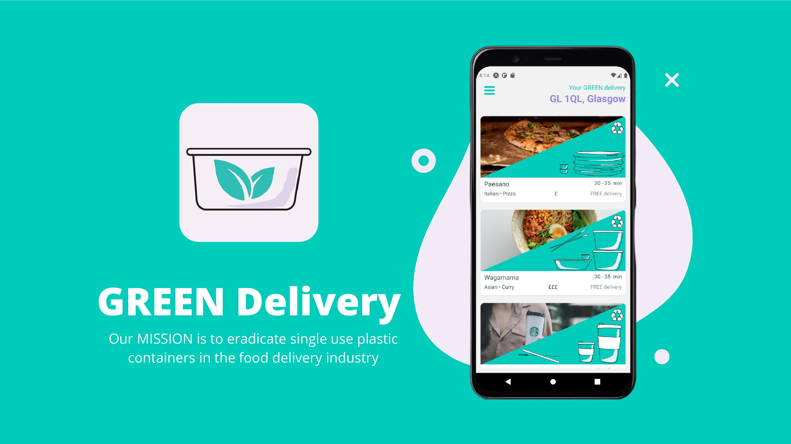
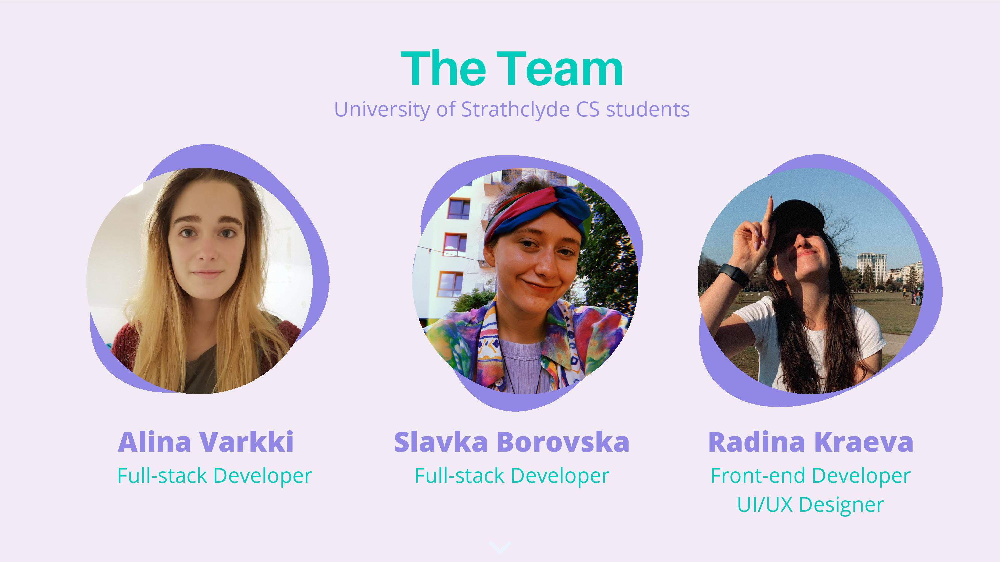

<h2>GREEN TEAMS :recycle: :handshake: 
This project was developed in 63 hours as a submission for Microsoft Challenge during <a href="https://www.thehackathoncompany.com/herhackathon-2021">HerHackathon</a> :star: </h2>

GREEN Teams is creating a sustainable future through shared responsibility and team building challenges. 
 
The app is developed in react native 

<h2>Submission and pitch</h2>

Our hackathon submission and pitch can be found <a href="">HERE</a> 
 

<h2>Visuals</h2>

<!--  -->
<!--  -->

<!--  -->
<!--  -->
<!--  -->

